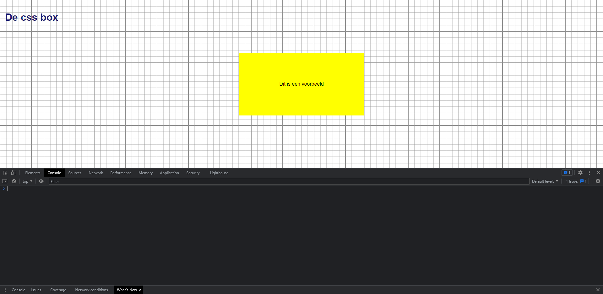
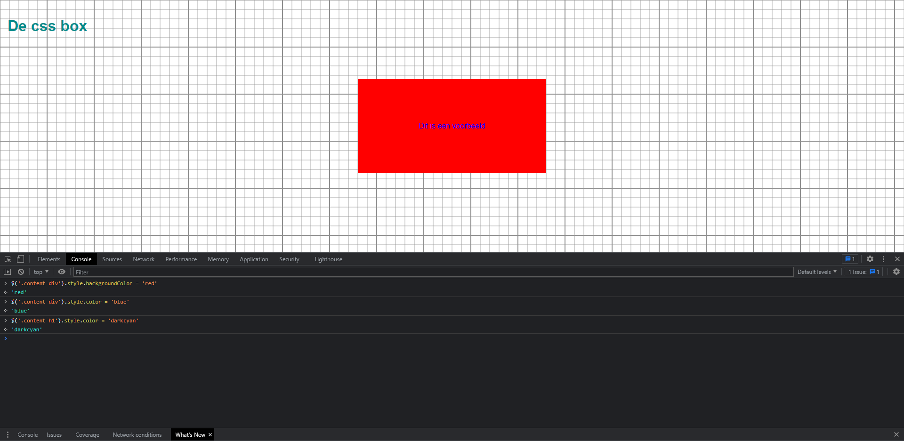

# Les12: after en before
Ik heb dit gedaan door eerst het element te selecteren wat ik wil veranderen met *\$('.content div')*  
en daarna heb ik de style *backgroundColor* gekozen en veranderd naar "red".  
Vervolgens heb ik de style *color* gekozen om de tekstkleur te veranderen naar "blue".  
Als allerlaatst heb ik de *\$('.content h1')* geselecteerd, dit is de header met de tekst "De css box".  
Hiervan heb ik de kleur veranderd met *\$('.content h1').style.color = "darkcyan"*.  
  
## Before
  
  
## After
